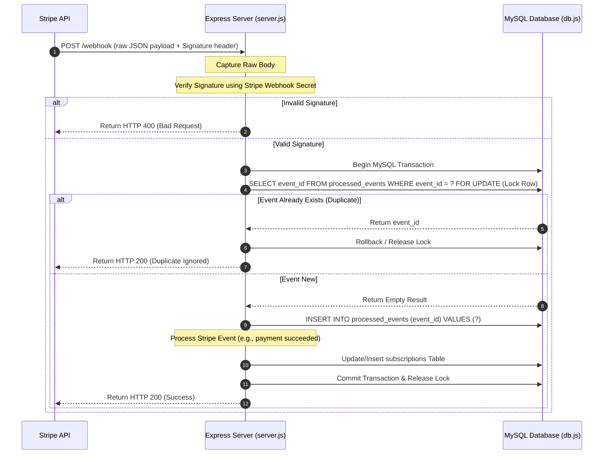

# Stripe Webhook Handler - Technical Documentation & Architecture Reference

This document provides a detailed breakdown of the Stripe Webhook integration codebase, detailing the database schema design, request life cycle, transactional idempotency checks, event-handling mechanics, and local verification flows.

---

## 🏗️ Architecture & Data Flow

When Stripe performs an event (e.g., payment succeeded, subscription cancelled), it delivers an HTTP `POST` request to our server. Below is the lifecycle of a webhook request in this application:



---

## 🗄️ Database Schema Design

The project uses two tables in the MySQL `stripe_demo` database, defined in [sql/schema.sql](file:///Users/burrakranthikiran/Kranthi%20Kiran%20Burra%20Project/Stripe/sql/schema.sql):

### 1. `subscriptions` Table
Maintains the current subscription status for each customer.
* **`customer_id`** (`VARCHAR(100)` PRIMARY KEY): The unique identifier generated by Stripe (e.g., `cus_xxxx`). Since we support one subscription per customer for this assessment, this is the primary key.
* **`subscription_id`** (`VARCHAR(100)`): Stripe subscription ID (e.g., `sub_xxxx`).
* **`plan`** (`VARCHAR(100)`): The Stripe Price/Plan ID active on the subscription (e.g., `price_xxxx`).
* **`status`** (`VARCHAR(30)`): The status of the subscription (e.g., `active`, `past_due`, `cancelled`).
* **`current_period_end`** (`BIGINT`): Unix timestamp indicating when the current billing cycle ends.
* **`created_at` / `updated_at`** (`TIMESTAMP`): Automatically tracks when rows are created or modified.

### 2. `processed_events` Table
Tracks processed Stripe Webhook event IDs to enforce idempotency.
* **`event_id`** (`VARCHAR(100)` PRIMARY KEY): The unique Stripe Event ID (e.g., `evt_xxxx`).
* **`processed_at`** (`TIMESTAMP`): Timestamp indicating when the event was processed.

---

## 🔒 Idempotency & Database Transactions

Stripe guarantees **at-least-once delivery** of webhooks, meaning Stripe may retry sending an event if our server takes too long to respond, or due to network timeouts. To prevent duplicate updates (e.g., renewing a subscription duration twice), we implement strict idempotency checks inside an atomic MySQL transaction:

1. **Transaction Hook**: We fetch a connection from the MySQL Pool and call `connection.beginTransaction()`.
2. **Pessimistic Locking (`FOR UPDATE`)**: We run `SELECT event_id FROM processed_events WHERE event_id = ? FOR UPDATE`. This locks the row (if it exists) or blocks concurrent transactions trying to inspect the same event ID.
3. **Insert Check**: If the row is found, we roll back the transaction and return HTTP `200` to Stripe (telling them we received it, but ignoring the duplicate).
4. **Processing & Insertion**: If the row does not exist, we insert it into `processed_events` and proceed to update the `subscriptions` table.
5. **Commit**: We commit the transaction, releasing the lock. If any database queries fail during this workflow, the transaction triggers a `ROLLBACK`, restoring database integrity.

This implementation resides in [db.js](file:///Users/burrakranthikiran/Kranthi%20Kiran%20Burra%20Project/Stripe/db.js) and [server.js](file:///Users/burrakranthikiran/Kranthi%20Kiran%20Burra%20Project/Stripe/server.js).

---

## 📁 Code Implementation Overview

### 1. Database Connection (`db.js`)
Configured to use `mysql2/promise` with connection pooling to handle multiple requests concurrently.
* **`query(sql, params)`**: Simple wrapper for standard reads/queries.
* **`withTransaction(callback)`**: Utility that handles connection acquisition, transaction initialization, callback execution, committing on success, rolling back on error, and connection release.

### 2. Server Entry Point (`server.js`)
* **Raw Body Parsing**: Stripe verification requires the exact string payload sent by Stripe. Express's standard `express.json()` parses body bytes, altering signatures. We isolate the `/webhook` route using `express.raw({ type: 'application/json' })` to retain the exact payload.
* **Signature Verification**:
  ```javascript
  event = stripe.webhooks.constructEvent(req.body, sig, endpointSecret);
  ```
  This guarantees the event was sent by Stripe and was not tampered with.

---

## 📡 Stripe Events Handled

We process three critical subscription lifecycle events in [server.js](file:///Users/burrakranthikiran/Kranthi%20Kiran%20Burra%20Project/Stripe/server.js):

### 1. `invoice.payment_succeeded`
Triggered when a customer successfully pays an invoice (e.g. initial checkout or monthly renewal).
* **Action**: Upsert subscription (using `INSERT ... ON DUPLICATE KEY UPDATE`).
* **Database Updates**: Set `status = 'active'`, record the Stripe `subscription_id`, store the active `plan` (Price ID), and update `current_period_end`.

### 2. `invoice.payment_failed`
Triggered when a billing attempt fails (e.g. expired card, insufficient funds).
* **Action**: Update the status to `past_due`.
* **Database Updates**: Set `status = 'past_due'` for the corresponding customer. We do **not** cancel the subscription immediately, allowing the customer grace time or Stripe to attempt dunning.

### 3. `customer.subscription.deleted`
Triggered when a subscription is explicitly cancelled or terminated due to unpaid invoices.
* **Action**: Terminate subscription.
* **Database Updates**: Set `status = 'cancelled'` and update the final `current_period_end`.

---

## 🔍 Endpoints Reference

### 1. POST `/webhook`
* **Purpose**: Receive webhook events from Stripe.
* **Headers**: `stripe-signature` (required)
* **Response Status Codes**:
  * **200**: Successfully processed event OR duplicate event safely ignored.
  * **400**: Signature verification failed.
  * **500**: Internal server database or connection error.

### 2. GET `/subscriptions/:customerId`
* **Purpose**: Fetch the current active/inactive subscription profile of a customer.
* **Sample URL**: `/subscriptions/cus_test_84mder`
* **Response Headers**: `Content-Type: application/json`
* **Response JSON Format**:
  ```json
  {
    "customer_id": "cus_test_84mder",
    "subscription_id": "sub_test_958xil",
    "plan": "price_premium_monthly",
    "status": "active",
    "current_period_end": 1800000000
  }
  ```

---

## 📈 Production Improvements Roadmap

To scale this webhook handler for high-volume production loads, we recommend introducing the following improvements:

1. **Queueing System (BullMQ / RabbitMQ)**: Rather than processing business logic inside the HTTP request loop, write the webhook raw payload to a fast queue and immediately return HTTP `200` to Stripe. This avoids HTTP timeouts.
2. **Audit Logging (MongoDB / PostgreSQL)**: Store the full webhook raw payload in an audit database for troubleshooting and historical tracking.
3. **Structured Logging (Winston / Pino)**: Introduce JSON-formatted structured logging for trace paths, request IDs, and easy ingestion into logging systems like Elasticsearch, Datadog, or Google Cloud Logging.
4. **Monitoring and Alerts**: Add error monitors (e.g., Sentry) to alert developers when database transactions fail or signature verification rates drop.
